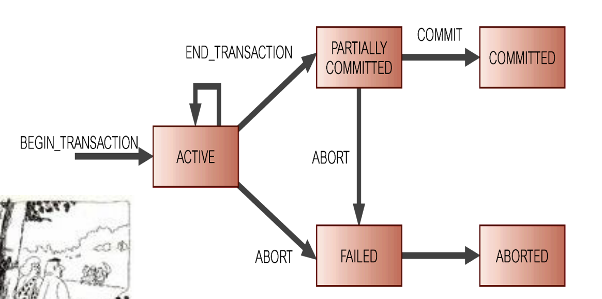
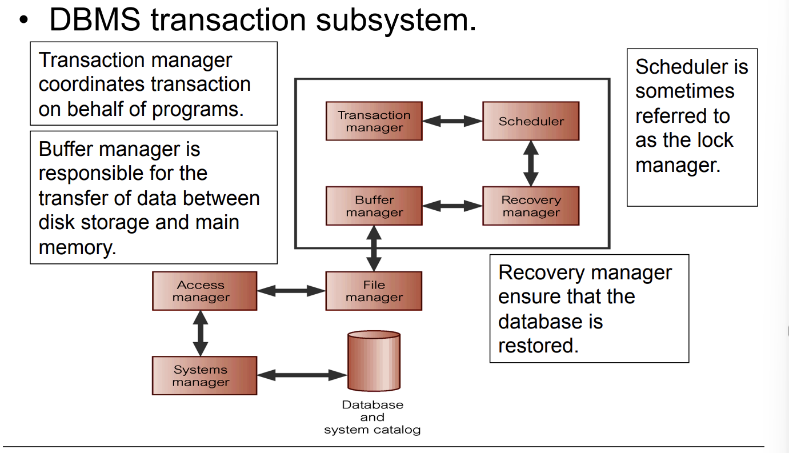
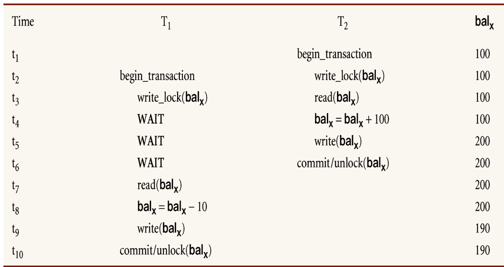
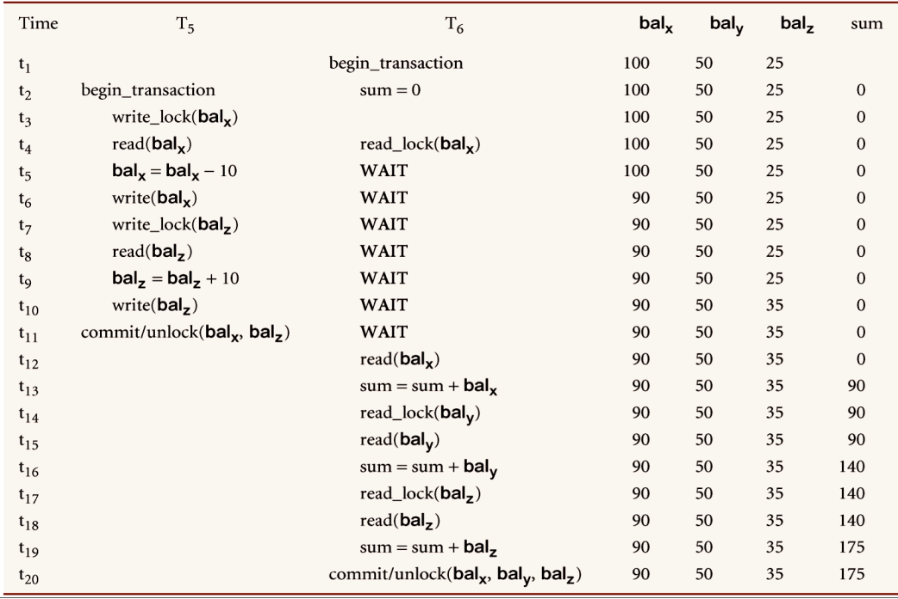
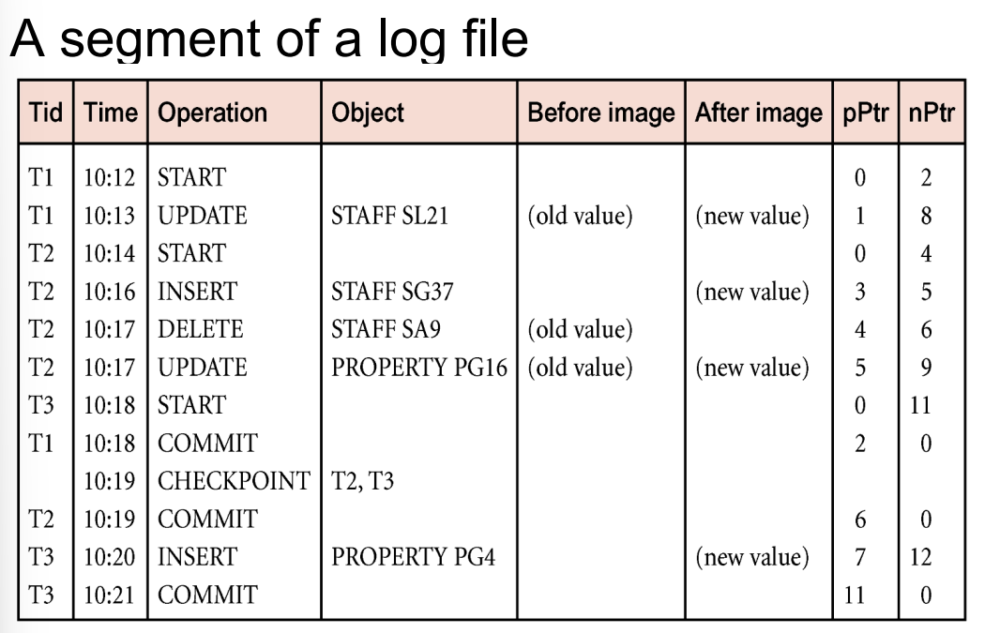

# Chapter10 Transaction Management

卡        明细
"Update    insert"
卡1         卡2
+100        -100

可靠性 +100 -100 断电
一致性 -1 -1 = -1

完整性 安全性

Transaction:An action, or series of actions,reads or updates

read(staffNo=x,salary)
salary=salary*1.1
write(staffNo=x,new_salary)

commits
aborts
rolled back

committed transaction cannot be aborted.

Begin Transaction
&nbsp;&nbsp;SQL1
&nbsp;&nbsp;/0
&nbsp;&nbsp;SQL2
Commit

diagram

四大特性acid
a -> atomocity    原子性
c -> consistency  一致性
i -> isolation    隔离性
d -> durability   持久性

## 10.2 Concurrency Control
交叉导致三种问题：
– Lost update problem.：丢失更新
– Uncommitted dependency problem. (脏读)未提交依赖
– Inconsistent analysis problem：不可重复读/不一致分析

Two basic concurrency control techniques:
- Locking
- Timestamping

读锁叫共享锁 写锁叫独占(排他)锁
可读  不可写 可读 可写

Two-phase locking:Transaction follows 2PL protocol if all locking operations precede first unlock operation in the ransaction

Two phases for transaction:
– Growing phase: acquires all locks but cannot release any locks.
– Shrinking phase: releases locks but cannot acquire any new locks.

不可以纯串行，要允许交叉执行
T1 T2一起来，谁先执行都可以，就是可串行化的
可串行性不意味着可恢复性
引入锁，一种方法

|   | S锁  | X锁  |
| - | ---- | ---- |
|   | 共享 | 开发 |
| S | √   | ×   |
| X | ×   | ×   |

一级封锁协议

**两个锁协议**：可防止一级及脏读但无法防止不可重复
1，写的时候上X锁，事务结束释放
2，S锁，读完就释放

3级封锁协议
更改2.S锁，所有锁都是事务结束才释放

加锁解锁都需要开销，有的用不到三级封锁协议，例如值机。

### 10.2.3 Locking methods

增长阶段：只加锁不解锁
收缩阶段：只解锁不加锁

保证了可串行性，并没有保证可恢复性

严格两个锁协议：所有的释放都要等到commit才释放，

### 10.2.4 DeadLocking

Three general techniques for handling deadlock：

- Timeouts
- Deadlock prevention
- Deadlock detection and recovery
  - Create a node for each transaction
  - Create edge Ti->Tj
  - Deadlock exits if and only if WFG cantains cycle

### 10.2.5时间戳

创建的唯一的标志符，一个事务启动的时候就会给一个唯一标识，逻辑上自增的计数器

简答题

CC(并发控制协议){
  锁  悲观的 (来了我就锁) 死锁问题 检测 环状图
  Timestamp 乐观的 (大部分情况不会发生冲突) 先启动事务>后启动事务
  MVCC(多版本并发控制) 读-写冲突 保留数据向原始版本在内存，其他事务在读的时候，读的是老版本，在什么时间范围之内，应该让这个事务看到哪一段的版本
}

### 10.2.6 粒度

粒度：并发控制协议选择作为保护单位的数据项的大小

用层次结构来表示锁的粒度
当节点被锁定时，其所有后代节点也将被锁定。
上锁时要看祖先还要看子孙

给record上锁，给其祖先上意向锁，意向锁可以是读锁，也可以是写锁，申请时自上而下，释放时自下而上

## 10.3 Database Recovery(恢复)

### 10.3.1 The Need of Recovery

- Main memory
- Magnetic disk
- Magnetic type
- Optical disk

数据在磁盘上，数据在内存的缓冲区里(buffer)，事务一提交就落盘就省事了，如果不是怎么保证一致呢
就说断电，导致内存和磁盘数据不一致，恢复管理就来解决这个问题。主观的客观的硬件的软件的

### 10.3.2 Transcations and Recovery

buffers   flush -> 刷写到磁盘上
force-writting

如果还没flush到磁盘上 如果还没提交但重启了 必须要undo

commit 断电 redo
内存缓冲区满了，undo{
  日志
}

### 10.3.3 Recovery Facilities
- 备份:全局备份，增量备份,物理备份，逻辑备份
- 日志:
 执行之前先写日志
 会变得非常庞大，如果重启之后去检查，那么非常累，非常久
 所以有所谓的检查点
- 检查点(CheckPoint):数据库和日志文件的同步点，所有缓冲会被强制写到secondary storage
  - 所有在main memory的log records写到second storage
  - 把所有更改完的块写到外存里
  - 在日志文件里写到一个检查点
  
  活跃的事务要写在同一个日志文件

### 10.3.4 Recovery Techniques
- Deferred Update(延迟更新)
  - 更新不会被写到数据库直到事务commit
  - 如果事务commit之前fails，所以不用做任何undo
  - commit之后可能落盘，也可能没flash，需要做redo
- Immediate Update
  - 事务没commit肯定要做undo
  - commit之后失败 需要做 redo
- Shadow Paging(影子页)
  打开Word会有一个隐藏文件，把你修改之前的页留一个快照，如果你修改好了，那我就不要之前的快照了，如果你没修改完故障了，那我就把原来的历史版拿出来。开销比较大

# Chapter11 Query Processing(查询处理)
更多的是关注于select语句

ACID
A atomic 原子的 全部或者都不性质，不可分割，要么全部执行，要么都不执行
C Consistency 一致的 从一种一致的状态转移到另一种一致的状态
I Isolation 隔离的 事务的执行是相互独立的
D Durability 持久性的 永久的保存在数据库中

调度 一组并发事务操作的序列，对于其中每个事务来说，该序列保留了该事物的所有操作的先后次序

串行调度，每一个事物的操作都按顺序执行，并且其中没有交叉的调度
非串行调度，一组并发事物的操作相互交叉的调度

可恢复性：如果Ti读了Tj先写的数据，那么Tj比Ti先提交

有两种方法保证并行
加锁和时间戳

加锁，用来控制并发访问数据的过程。当一个事务正在访问数据库，可以用所拒绝其他事物的访问请求，从而避免产生不正确的结果
如果加了共享锁，那么可以读不可以改
如果加了互斥锁，那么既可以读也可以改

两段锁协议：如果事务所有的加锁操作都在第一个解锁操作之前
扩展阶段
收缩阶段

解决以上三个问题

但是有一种级联回滚的现象。导致大量工作被撤销
有一种严格两段锁协议：直到事务的最后才允许释放所有的锁。
死锁：两个事务互相等待对方所持有的数据项
只有一种方式打破死锁，终止一个事务或多个事务
三种普遍方法处理死锁：
- Timeouts 检测时间，如果超过系统设定的时间则自动重启
- Deadlock prevention
- Deadlock detection and recovery

时间戳方法
时间戳：由DBMS创建的，表示事物相对启动时间的具有唯一性的标识符
时间戳技术：越早的事务，时间戳越小，发生冲突时优先级越高

粒度：并发控制协议选择作为保护单位的数据项的大小
粒度的层次，检查其上 再检查其下
多粒度加锁，意向锁。当一个节点被加锁时，所有祖先节点就都被加了意向锁。意向锁可以互斥可以共享

数据库恢复