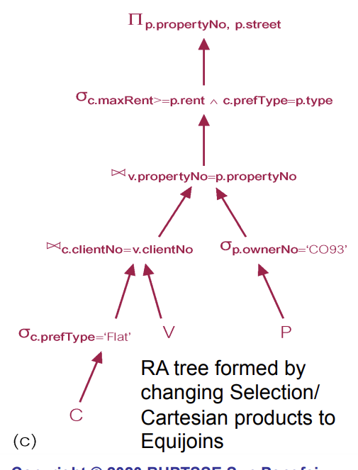
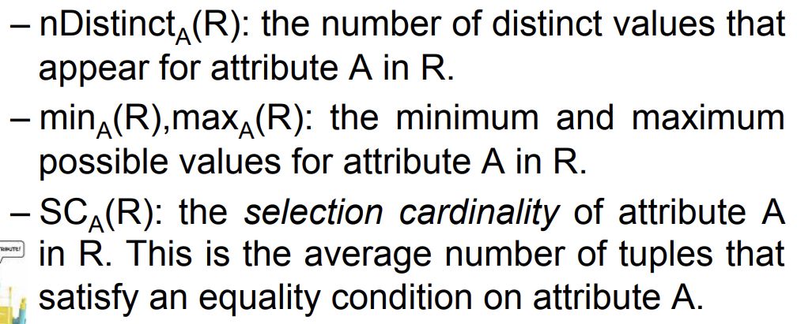

# Chapter11 Query Processing
## 11.1 Overview of Query Processing

优化分为逻辑优化和物理优化

------------考试不会考---------------

分析
规范化
semantic analysis
simplification
query restructuring

-------------------

查询优化
12条规则
把选择往下拽

把笛卡尔积变成选择加连接

## 11.5 五条指导
五条指导

---------这章会考，但不会考大题----------------

## 11.6 
nTuples(R)
bFactor(R)
nBlocks(R)

第二类：针对于属性

